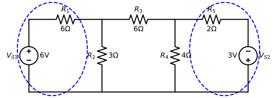
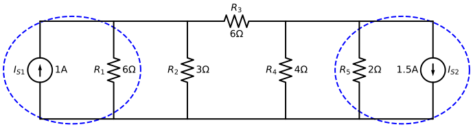

# Nodal Analysis

Nodal analysis is a fundamental method in circuit theory used to determine the voltage at various points (nodes) in an electrical circuit. The basic concepts include:

- **Node**: A point in a circuit where two or more circuit elements meet.
- **Reference Node (Ground)**: A node chosen as a reference point, usually assigned 0 V.
- **Node Voltage**: The electrical potential difference between a node and the reference node.

## Nodal Analysis Steps

- Step 1: Select a reference node and label non-reference node voltages
- Step 2. Label current directions (enter or leave) for the non-reference nodes and write Kirchhoff’s Current Law (KCL) for each non-reference node
- Step 3: Solve the system of equations

!!! info
    - **If you see the question blocks (?), please think for a second and expand it to see the answer.**
    - The detail steps of solving examples are provided.
    - You can also watch solution videos.

## Examples

### Example 1: Two voltage sources

!!! example "Example 1"

    Determine the node voltages and current go through all the resistors
      { width="450" }
---

#### Solution video (Ex1)

!!! info "Solution video"    
    

#### Step 1 (Ex1)

*Select a reference node and label non-reference node voltages*
{ width="450" }

There are 4 nodes in the circuit. We select bottom node `Node G` as the reference node $V_G = 0$.

??? question "Are there 3 nodes at the bottom of the circuit? (click to expand)"
    The entire bottom is called a **common node** because it is connected by wires. They are considered as a single node.

    { width="350" }

??? question "Why select the bottom as the reference node?"
    We typically selected the bottom as the reference node because we don't need to write KCL for the reference node, and the bottom node typically has the most branches connected to it.

The non-reference node voltages are $V_1$ at `Node 1`, $V_2$ at `Node 2`, and $V_3$ at `Node 3`.

`Node 2` is connected to the ground by the voltage source $V_{S1}$, hence,

$$
V_2 = 6 V
$$

In other words, the voltage rises from the ground at 0 V to `Node 2` to 6 V.

Similarly,

$$
V_3 = 3 V
$$

Then, we only have one unknown non-reference node voltage $V_1$.

!!! note "No need to label V2 or V3. They are labeled here for demonstration purposes."
    - Once you are familiar with the methods, you only need to label reference node and unknown non-reference nodes, in this case, $V_1$.
    - Voltage sources between a Node and Ground directly set the node voltage equal to the source value.

---

#### Step 2 (Ex1)

*Label current directions and write KCL*

{ width="450" }

We labeled $I_1, I_2, I_3$, then we need to write KCL `Node 1`.

??? question "Why do we label the current direction in this way?"
    - The short answer is that because of the polarity orientation of the two voltage sources, the current would likely flow in the labeled directions.
    - The long answer is that it does not really matter how we label the current direction.

??? question "What is KCL?"
    There are a few equations for writing KCLs.

    Equation 1: 
    $$
    \sum I_{enter} = \sum I_{leave}
    $$
    In words, the summation of currents enter a node equal to the currents leave that node. 
    
    Its variations inlcude:

    Equation 2: 
    $$
    \sum I_{enter} - \sum I_{leave} = 0
    $$

    Equation 3: 
    $$
    - \sum I_{enter} + \sum I_{leave} = 0
    $$

    Equation 4: 
    $$
    \sum I_{enter} = 0
    $$
    This equation assumes $I_{leave}$ is negative. 

    Equation 5: 
    $$
    \sum I_{leave} = 0
    $$
    This equation assumes $I_{enter}$ is negative. 

You can use any of the equations to write the KCL (expand the above block to see them). We will use Equation 2 to write the KCL for `Node 1`: $I_1 - I_2 +I_3= 0$.

Remember that in the Node 1nalysis method, our variables are `Node Voltages`. Now, we can use Ohm's Law to relate the currents, $I_1, I_2, I_3$, to the `Node Voltage` $V_1$.

By Ohm's Law, $I_1 = V_{R1}/R_1$ and apparently $V_{R1} = V_2 - V_1$. Then we will have:

$$
I_1= \frac{V_2 - V_1}{R_1} = \frac{6 - V_1}{6}
$$

Similarly:

$$
I_2= \frac{V_1 - V_G}{R_2} = \frac{V_1 - 0}{3} \\
I_3= \frac{V_3 - V_1}{R_3} = \frac{3 - V_1}{6}
$$

Finally, the KCL is

$$
I_1 - I_2 +I_3 = \frac{6 - V_1}{6} -  \frac{V_1}{3} + \frac{3 - V_1}{6} = 0
$$

#### Step 3 (Ex1)

*Solve equations*

For this example, solving the equation should be straightforward. We multiply both sides by their common denominator and then solve $V_1 = 2.25 V$.

Remember, our question also asks us to determine the currents. Using Ohm's Law we can solve them.

$$
I_1= \frac{V_2 - V_1}{R_1} = \frac{6 - 2.25}{6}=0.625\\
I_2 = \frac{V_1}{R_2} =\frac{2.25}{R_2} = 0.75 A\\
I_3= \frac{V_3 - V_1}{R_3} = \frac{3 - 2.25}{6}=0.125
$$

You can also verify that $I_1 - I_2 +I_3 = 0$.

!!! note "Important Notes"
    Once we solve the node voltages, we can find the current on any branch by using Ohm's Law and the power at each component. Therefore, regardless of what the question asks you to determine if you want to use the Node 1nalysis method, your immediate target is to find node voltages.

??? question "Why $V_{R1} = V_2-V_1$, why not $V_{R1} = V_1-V_2$?"
    - This is because of the **Passive Sign Convention**, which states that current enters the positive terminal of passive components, namely resistors, inductors, and capacitors. 
    - Remember that both voltage and current have two pieces of information. Voltage has magnitude and polarities, and current has magnitude and directions. 
    - The magnitude of voltage and current is related by Ohm's Law $V = I\cdot R$
    - The voltage polarity and current direction are related by the passive sign convention.
    -For example, in Figure 3, the current direction is labeled for all the resistors. Then, the polarities of the voltages are correspondently determined, though we did not label them. The following figure shows the voltage polarities. It has to be labeled in this way according to the passive sign convention.

    { width="400" }

    As can be seen, because we labeled $I_1$ from left to right, we assume $V_2$ is positive with respect to $V_1$, and hence $V_{R_1} = V_2 - V_1$. $V_1$ is positive with respect to $V_4$, hence $V_{R_2} = V_1 - V_4$. Similarly, $V_{R_3} = V_3 - V_1$.

    !!! note "You do NOT need to explicitly label the polarities when using node analysis."

??? question "Why do you make current leaving negative in the KCL equation?"
    Many students asked me why is $I_2$ negative in the following KCL equation.

    $$
    I_1 - I_2 + I_3 =  0
    $$

    We did not assume positive or negative current. We just used KCL Equation 2 as follows to write the KCL.

    $$
    \sum I_{enter} - \sum I_{leave} = 0
    $$
    
    A good way to think about it is that the $I_{leave}$ has a minus sign in front of it. 

    Only Equations 4 and 5 assume positive or negative current, see more detail in the above KCL discussion. 

??? question "Can we label the current differently?"
    Definitely! As mentioned earlier, you will have the same solutions regardless of how you label the current directions. Let's give it a try. We label all the current flow away from `Node 1` as follows in the left column. The right column shows the old way to label the current direction.

    |     Current as label early | All currents flow away from Node 1  |
    | :------------------------------------------: | :------------------------------------: |
    | { width="300" }  |{ width="300" } |
    |  $I_{1a} - I_2 + I_{3a} =  0$| $I_{1b} + I_2 + I_{3b} = 0$ |
    | $\frac{6 - V_1}{6} -  \frac{V_1}{3} + \frac{3 - V_1}{6} = 0$| $\frac{V_1 - 6}{6} +  \frac{V_1}{3} + \frac{V_1-3}{6} = 0$ | 
    |  $\frac{V_1 - 6}{6} +  \frac{V_1}{3} + \frac{V_1-3}{6} = 0$| |

    Apparently, we got exactly the same equation regardless of the labeled current direction. 

    Note that, when label all currents flow away from the `Node 1`, we used the KCL Equation 5 to write the KCL. 

!!! tip "Tips"
    Labeling all the currents flowing away from the non-reference nodes has the following advantages.

    - All the terms added together will equal zero. No subtraction.
    - The node voltage you are working on (e.g., $V_1$) is the leading variable of all the terms.

    Then, you will have little chance to make mistakes. This tip is general to the circuits with multiple unknown nodes. We will see it in Example 3. 

---

### Example 2: A variation

!!! example "Example 2"

    Determine the node voltages and the currents go through all components.
      { width="450" }
---
!!! info "Solution video"    
    

The solutions of $I_1, I_2, I_3, V_1$ are exactly the same as the Example 1. There is still only one unknown voltage node `Node 1`.

The differences are the currents $I_{V1}, I_{V2}$.

??? question "Can you find $I_{V1}, I_{V2}$?"
    $I_4 = \frac{V_{S1}-V_{S2}}{R_4} = \frac{6-3}{4} = 0.75A$

    $I_{V1}=I_1+I_4 = 0.625+0.75 = 1.375A$

    $I_{V2}= I_3-I_4 = 0.125 - 0.75 = -0.625A$

---

### Example 3: Two node equations

!!! example "Example 3"

    Determine the current go through $R_2$ for the below cirucit.
      { width="500" }
---

#### Solution video (Ex3)

!!! info "Solution video"    
    

--- 
#### Step 1 (Ex3)

*Select a reference node and label non-reference node voltages*

{ width="500" }

!!! note "No need to label V3 or V4. They are labeled here for demonstration purposes."
    - Once you are familiar with the methods, you only need to label reference node and unknown non-reference nodes, in this case, $V_1$ and $V_2$.
    - Voltage sources between a Node and Ground directly set the node voltage equal to the source value. 
    - However, we need to pay attention to the polarity, e.g., $V_4 = -3 V$

There are 5 nodes in the circuit. We select bottom node `Node G` as the reference node $V_G = 0$.

Similar to Example 1, `Node 3` is connected to `Node G` by the voltage source $V_{S1}$, hence,

$$
V_3 = 6 V
$$

Because the voltage drops from $0 V$ from `Node G` to `Node 4` by $3V$,

$$
V_4 = -3 V
$$


Then, we have two unknown node voltages `Node 1` and `Node 2`.

---

#### Step 2 (Ex3)

*Label current directions and write KCL*

!!! note "Try two ways to label current directions"
    - Method 1: As shown in Figure 7.
    - Method 2: Label all currents flowing away from `Node 1` and `Node 2`, as shown in Figure 8.
**Method 1**

{ width="500" }

!!! note "We use Equation 2 to write KCL"
    $$
    \sum I_{enter} - \sum I_{leave} = 0
    $$

For `Node 1`, KCL: $I_1-I_2-I_3=0$, use Ohm's Law:

$$
\frac{6 - V_1}{6} -  \frac{V_1}{3} - \frac{V_1-V_2}{6} = 0
$$

For `Node 2`, KCL: $I_3-I_4-I_5=0$, use Ohm's Law:

$$
\frac{V_1-V_2}{6} -  \frac{V_2}{4} - \frac{V_2-(-3)}{2} = 0
$$

!!! warning "Common Mistake"

    $$
    \frac{V_2-3}{2}
    $$
---
**Method 2**
{ width="500" }

!!! note "We use Equation 5 to write KCL"
    $$
    \sum I_{leave} = 0
    $$

For `Node 1`, KCL: $I_{1a}+I_2+I_{3a}=0$, use Ohm's Law:

$$
\frac{V_1-6}{6} +  \frac{V_1}{3} + \frac{V_1-V_2}{6} = 0
$$

For `Node 2`, KCL: $I_{3b}+I_4+I_5=0$, use Ohm's Law:

$$
\frac{V_2-V_1}{6} +  \frac{V_2}{4} + \frac{V_2-(-3)}{2} = 0
$$

!!! note "Comparison of the two methods"
    You will see the two methods provide you with the same equations (after some algebra).

    | Nodes | Method 1 | Method 2|
    | :-------- | :--------: | :-------: |
    |Node 1 | $\frac{6 - V_1}{6} -  \frac{V_1}{3} - \frac{V_1-V_2}{6} = 0$ |  |
    || $-\frac{V_1-6}{6} -  \frac{V_1}{3} - \frac{V_1-V_2}{6} = 0$ |  |
    || $\frac{V_1-6}{6} +  \frac{V_1}{3} + \frac{V_1-V_2}{6} = 0$ | $\frac{V_1-6}{6} +  \frac{V_1}{3} + \frac{V_1-V_2}{6} = 0$ |
    |Node 2 | $\frac{V_1-V_2}{6} -  \frac{V_2}{4} - \frac{V_2-(-3)}{2} = 0$ |  |
    |  | $\frac{V_2-V_1}{6} +  \frac{V_2}{4} + \frac{V_2-(-3)}{2} = 0$ |  |
    |  | $\frac{V_2-V_1}{6} +  \frac{V_2}{4} + \frac{V_2-(-3)}{2} = 0$ | $\frac{V_2-V_1}{6} +  \frac{V_2}{4} + \frac{V_2-(-3)}{2} = 0$ |

    !!! tip "However, using the second method, you have less chance to make mistakes."   
        - For the `Node 1` KCL equation, $V_1$ is always leading in each term. 
        - For the `Node 2` KCL equation, $V_2$ is always leading in each term.
        - The equation always adds all the terms together to equal 0. No need to worry about minus signs. 

??? question "Can we label $I_{3a}$ and $I_{3b}$ on the same branch to against each other?"
    - Yes. It basic means $I_{3a}=-I_{3b}$.
    - In fact, $I_{3a}=0.43A, I_{3b}=-0.43A$.
    - $I_3a$ and $I_3b$ represent **the same current**. Their directions are opposite, and their magnitudes are also opposite (one positive and the other negative).
    - Remember: current has two pieces of information: magnitude and directions.

??? question "What if the current direction is given in the circuit?"
    Just use it then. You don't need to re-define the current direction.

---

#### Step 3 (Ex3)

*Solve equations*

Performing algebra, the above two equations will become:

$$
4V_1-V_2=6 \\
-2V_1+11V_2=-18
$$  

There 2 unknowns and 2 equations. We can solve them using Gaussian elimination and matrix method.

!!! note "Solving the equations"
    === "Gaussian elimination"
        - The first equation plus the second equation times 2, then $V_1$ will be eliminated.
        - We will get $V_2 = -1.43 V$.
        - Then substitute $V_2$ to the first equation, we will find $V_1=1.14 V$

    === "Matrix"
        - Obtain the matrix

        $$
        \begin{bmatrix}
            4 & -1\\
            -2 & 11
        \end{bmatrix}
        \begin{bmatrix}
            V_1 \\
            V_2
        \end{bmatrix}=
        \begin{bmatrix}
            6\\
            -18
        \end{bmatrix}
        $$

        - Solve it using a caculator or software. 

        $$
        \begin{bmatrix}
            V_1 \\
            V_2
        \end{bmatrix}=
        \begin{bmatrix}
            4 & -1\\
            -2 & 11
        \end{bmatrix}^{-1}
        \begin{bmatrix}
            6\\
            -18
        \end{bmatrix}
        $$

Remember, our question asks us to determine the current go through $R_2$, then:

$$
I_2 = \frac{V_1}{R_2} = 0.38 A
$$

!!! note "Important Notes"

    Once we solve the node voltages, we can find the current on any branch by using Ohm's Law and the power at each component. Therefore, regardless of what the question asks you to determine if you want to use the Node 1nalysis method, your immediate target is to find node voltages. 
---

### Example 4: Both source types

!!! example "Example 4"
    Determine $I_o$.

    { width="450" }

---

#### Solution video (Ex4)

!!! info "Solution video"    
    

--- 

#### Step 1 (Ex4)

*Select a reference node and label non-reference node voltages*

{ width="450" }

The bottom node is grounded. **$V_1$ is the unknown non-reference node.**  

$I_2$ is labeled for Step 2. $I_o$ going through $R_3$ was labeled by the cirucit, we will use it.

---

#### Step 2 (Ex4)

*Label current directions and write KCL*

The current going through $R_1$ is $I_{S1}$. It is known and we do not need to caculate it.

!!! note "We use Equation 2 to write KCL"
    $$
    \sum I_{enter} - \sum I_{leave} = 0
    $$

$$
I_{S1} - \frac{V_1}{R_2} -  \frac{V_1-V_{S1}}{R_3} = 0
$$

---

#### Step 3 (Ex4)

*Solve equations*

$$
1 - \frac{V_1}{6} -  \frac{V_1-3}{6} = 0\\
$$

We can solve $V_1 = 4.5V$.

Using Ohm's Law, we can find.

$$
I_o = \frac{V_1-V_{S1}}{R_3} = \frac{4.5-3}{6}=0.25A\\
$$

!!! warning "Common mistakes"
    - $I_o = \frac{V_1}{R_3}$. It misses $-V_{S1}$
    - Label the current going through $R_1$ (as follows) and try to caculate it. For example, $I_1=\frac{V_1}{R_1}$ (wrong)

    { width="400" }

---

### Example 5: Two current sources

!!! example "Example 5"
    Determine the node voltages and currents in each branch

    { width="450" }
---

#### Solution video (Ex5)

!!! info "Solution video"    
    

--- 

#### Step 1 (Ex5)

*Select a reference node and label non-reference node voltages*

{ width="500" }

The bottom node is grounded. **$V_1$ and $V_2$ are unknowns.**  

$I_1, I_2, I_3$ are labeled for Step 2.

---

#### Step 2 (Ex5)

*Label current directions and write KCL*


!!! note "We use Equation 2 to write KCL"
    $$
    \sum I_{enter} - \sum I_{leave} = 0
    $$

For `Node 1`, KCL: $I_{S1}-I_1-I_2=0$, use Ohm's Law:

$$
I_{S1} - \frac{V_1}{R_1} -  \frac{V_1-V_2}{R_2} = 0
$$

For `Node 2`, KCL: $I_2-I_3-I_{S2}=0$, use Ohm's Law:

$$
\frac{V_1-V_2}{R_2} -  \frac{V_2}{R_3} - I_{S2} = 0
$$

---

#### Step 3 (Ex5)

*Solve equations*

Plug in numbers to the above two equations:

$$
1 - \frac{V_1}{12} -  \frac{V_1-V_2}{6} = 0\\
\frac{V_1-V_2}{6} -  \frac{V_2}{6} - 4 = 0
$$

We can solve $V_1 = -6V$ and $V_2 = -15V$.

Using Ohm's Law, we can find all the currents.

$$
I_1 = \frac{V_1}{R_1} = \frac{-6}{12}=-0.5A\\
I_2 = \frac{V_1-V_2}{R_2} = \frac{-6+15}{6}=1.5A\\
I_3 = \frac{V_2}{R_3} = \frac{-15}{6}=-2.5A
$$

---

## G-Matrix

If all the sources of a circuit are independent current sources, we can directly write a **G-Matrix** such that $G\vec{V}=\vec{I}$, where $\vec{V}$ is the vector of node voltages and $\vec{I}$ is the vector of entering current from the current sources. Then, we can solve $\vec{V} = G^{-1}\vec{I}$

Lets revisit the Example 5, starting from the two node equations.

$$
I_{S1} - \frac{V_1}{R_1} -  \frac{V_1-V_2}{R_2} = 0\\
\frac{V_1-V_2}{R_2} -  \frac{V_2}{R_3} - I_{S2} = 0
$$

Lets do some algebra and change them to the following.

$$
\frac{V_1}{R_1} + \frac{V_1-V_2}{R_2} = I_{S1}\\
-\frac{V_1-V_2}{R_2} +  \frac{V_2}{R_3} = -I_{S2}
$$

Then factorize $V_1$ and $V_2$ terms,

$$
(\frac{1}{R_1}+\frac{1}{R_2}) V_1 - \frac{1}{R_2}V_2 = I_{S1}\\
- \frac{1}{R_2}V_1 + (\frac{1}{R_2}+\frac{1}{R_3}) V_2  = -I_{S2}
$$

Then, transform them to matrix format.

$$
\begin{bmatrix}
\frac{1}{R_1}+\frac{1}{R_2} & - \frac{1}{R_2}\\
- \frac{1}{R_2} & \frac{1}{R_2}+\frac{1}{R_3}
\end{bmatrix}
\begin{bmatrix}
V_1 \\
V_2
\end{bmatrix} =
\begin{bmatrix}
I_{S1} \\
-I_{S2}
\end{bmatrix}
$$

In a more compact form: $G\vec{V}=\vec{I}$, where

$$
G =
\begin{bmatrix}
\frac{1}{R_1}+\frac{1}{R_2} & - \frac{1}{R_2}\\
- \frac{1}{R_2} & \frac{1}{R_2}+\frac{1}{R_3}
\end{bmatrix} =
\begin{bmatrix}
G_{11} & G_{12} \\
G_{21} & G_{22} 
\end{bmatrix}
$$

!!! note "G-Matrix has the following properties"

    - The diagonal components of the G-matrix are made up of the sum of the conductances of the resistors connected to the corresponding node.
    - The non-diagonal components are made up of the negative conductance of the resistor connected between the $i^{th}$ and $j^{th}$ nodes.
    - The G-matrix is symmetric.

For example, $R_1$ and $R_2$ are connected to `Node 1`, then the first diagonal components $G_{11} = \frac{1}{R_1}+\frac{1}{R_2}=G_1 + G_2$.

$R_2$ and $R_3$ are connected to `Node 2`, then the second diagonal components $G_{22} = \frac{1}{R_2}+\frac{1}{R_3}=G_2 + G_3$.

$R_2$ connects `Node 1` and `Node 2`, then the non-diagonal component $G_{12}=- \frac{1}{R_2}$.

$R_2$ also connects `Node 2` and `Node 1`, then the non-diagonal component $G_{21}=- \frac{1}{R_2}$. Therefore, the G-Matrix is symmetric.

The $i^{th}$ component of the $\vec{I}$ is the current from the current sources entering `Node i`. In other words, entering is positive and leaving is negative.

For example,

$$
\vec{I} = \begin{bmatrix}
I_{S1} \\
-I_{S2}
\end{bmatrix}
$$

$I_{S_1}$ enters `Node 1`, then the first componet of $\vec{I}$ is $I_{S_1}$.

$I_{S_2}$ leaves from `Node 2`, then the second componet of $\vec{I}$ is $-I_{S_2}$. It is negative becasue it leaves the node. 

!!! note
    - These preperties are general, so we can write a **G-Matrix** for circuits only have independent current sources.
    - This G-Matrix method is greatly useful to analyze large networks (e.g., power systems) using computers.

!!! warning "**G-Matrix** method can be applied to circuits where all the sources are independent current sources"
    If there are voltages presented in the circuits, we may be able to do source conversion from voltage sources to current sources, which can be discussed later.

### Example 6: Using G-Matrix method

!!! example "Example 6"
    Write G-Matrix and $\vec{I}$ and use a calculator or any other tools (e.g., MATLAB) to solve node voltages.
    { width="500" }

---

#### Solution video (Ex6)

!!! info "Solution video"

    Coming soon...

---

??? question "Give it try! Then, expand this block to see the solution"
    { width="500" }

    !!! note "The three nodes in the blue dashed circuit is a common node, i.e., a sigle node."

    $$
    G =
    \begin{bmatrix}
    \frac{1}{R_1}+\frac{1}{R_2} + \frac{1}{R_5} & - \frac{1}{R_2} & -\frac{1}{R_5}\\
    - \frac{1}{R_2} & \frac{1}{R_2}+\frac{1}{R_3} & -\frac{1}{R_3}\\
    -\frac{1}{R_5} & -\frac{1}{R_3} & \frac{1}{R_3}+\frac{1}{R_4} + \frac{1}{R_5}
    \end{bmatrix}
    $$

    The circuit has 3 nodes, so the G matrix is $3\times 3$. 

    $R_{1,2,5}$ connected to `Node 1`, then $G_{11}$ is the sum of their conductance. 

    $R_{2,3}$ connected to `Node 2`, then $G_{22}$ is the sum of their conductance. 

    $R_{3,4,5}$ connected to `Node 3`, then $G_{33}$ is the sum of their conductance. 

    $R_2$ connects `Node 1` and `Node 2`, then $G_{12}=G_{21}$ is its negative conductance. 

    $R_5$ connects `Node 1` and `Node 3`, then $G_{13}=G_{31}$ is its negative conductance. 

    $R_3$ connects `Node 2` and `Node 3`, then $G_{23}=G_{32}$ is its negative conductance. 

    !!! note "The current vector only contains current sources. Not any other currents."

    $$
    \vec{I}=
    \begin{bmatrix}
    I_{S1}\\
    -I_{S2}\\
    0
    \end{bmatrix}
    $$

    The current source $I_{S1}$ enters `Node 1`, then the first compent of $\vec{I}$ is $I_{S1}$.

    The current source $I_{S2}$ leaves `Node 2`, then the second compent of $\vec{I}$ is $I_{S2}$.

    No current source enters or leaves `Node 3`, then the third compent of $\vec{I}$ is $0$.

    
    Solve $\vec{V} = G^{-1}\vec{I}$

    $$
    \vec{V}=
    \begin{bmatrix}
    -7.6283 \\
    -18.2454\\
    -7.0929
    \end{bmatrix}
    $$


    !!! info "Code to solve the node voltages"
        === "Python code"
            ``` py
            import numpy as np

            # Define the resistances (in ohms)
            R1 = 12  # Resistance of R1
            R2 = 6   # Resistance of R2
            R3 = 5   # Resistance of R3
            R4 = 3   # Resistance of R4
            R5 = 4   # Resistance of R5

            # Define the current sources (in amperes)
            IS1 = 1  # Current source entering Node 1
            IS2 = 4  # Current source leaving Node 2

            # Calculate the conductances (G = 1/R)
            G1 = 1 / R1
            G2 = 1 / R2
            G3 = 1 / R3
            G4 = 1 / R4
            G5 = 1 / R5

            # Define the G matrix
            G = np.array([
                [G1 + G2 + G5, -G2,          -G5],
                [-G2,          G2 + G3,      -G3],
                [-G5,          -G3,          G3 + G4 + G5]
            ])

            # Define the current vector (I)
            I = np.array([
                IS1,
                -IS2,
                0
            ])

            # Solve for the node voltages (V)
            V = np.linalg.solve(G, I)

            # Display the results
            print("Node Voltages (V):")
            print(V)
            ```
        === "MATLAB code"
            ``` matlab
            % Define the resistances (in ohms)
            R1 = 12; % Resistance of R1
            R2 = 6; % Resistance of R2
            R3 = 5; % Resistance of R3
            R4 = 3; % Resistance of R4
            R5 = 4; % Resistance of R5

            % Define the current sources (in amperes)
            IS1 = 1;  % Current source entering Node 1
            IS2 = 4;  % Current source leaving Node 2

            % Calculate the conductances (G = 1/R)
            G1 = 1 / R1;
            G2 = 1 / R2;
            G3 = 1 / R3;
            G4 = 1 / R4;
            G5 = 1 / R5;

            % Define the G matrix
            G = [
                G1 + G2 + G5, -G2,          -G5;
                -G2,          G2 + G3,      -G3;
                -G5,          -G3,          G3 + G4 + G5
            ];

            % Define the current vector (I)
            I = [
                IS1;
                -IS2;
                0
            ];

            % Solve for the node voltages (V)
            V = G \ I; % or V = inv(G)*I

            % Display the results
            disp('Node Voltages (V):');
            disp(V);
            ```
---
### Example 7: Source transform to use G-Matrix

!!! question "Can we use G-Matrix method for the following circuit?"
    Yes. But we need to do a source transform. 

    { width="450" }

---

#### Solution video (Ex7)

!!! info "Solution video"

    Coming soon...
---

!!! info "Source transform"
    - Source transformation is a technique in circuit analysis that allows you to convert between a voltage source in series with a resistor and a current source in parallel with a resistor.
    - It is directly related to Thevenin and Norton theorems.

{ width="150" }  { width="170" }

The above two circuit can be tranformed from each other, given the following relationship. 

$$
V_{th} = I_N R_N\\
I_N = \frac{V_{th}}{R_{th}}\\
R_{th} = R_N
$$

where th stands for Thevenin, and N stands for Norton. 

---

Then, the circuits can be transformed as follows.
{ width="520" }
{ width="700" }
where $I_{S1}=\frac{V_{S1}}{R_1}$ and $I_{S2}=\frac{V_{S2}}{R_5}$.

Then, we can writ G-Matrix and I vector. 

---

## Supernode

- Voltage sources between two non-reference nodes.
- Treat the two nodes as a single *supernode*.
- Apply KCL to the supernode.
- Use the voltage source to relate the voltages of the two nodes.

---
### Example 8: Supernode

!!! example "Example 8"
    Determine $V_o$

    { width="450" }
---

#### Solution video (Ex8)

!!! info "Solution video"

    Coming soon...
---

#### Step 1 (Ex8)

*Select a reference node and label non-reference node voltages*

{ width="550" }

The bottom node is grounded. **$V_1$ and $V_2$ are unknowns.**  

$I_1, I_2, I_3, I_4$ are labeled for Step 2.

---

#### Step 2 (Ex8)

*Label current directions and write KCL*


!!! note "We use Equation 2 to write KCL"
    $$
    \sum I_{enter} - \sum I_{leave} = 0
    $$


However, we cannot write regular KCL for `Node 1` or `Node 2`, because we cannot directly determine the current flow from `Node 1` to `Node 2`.

There is no resistors between `Node 1` to `Node 2`, so we cannot use Ohm's Law. 

!!! info "Supernode"
    - If there is a voltage source between two non-reference nodes, we treat the two nodes as a single *supernode*.
    - Apply KCL to the supernode.
    - Use the voltage source to relate the voltages of the two nodes.

{ width="550" }

There are 5 branches connect to the `Supernode`. The currents are $I_{S1},I_{S2},I_1,I_2,I_3$. We treate `Node 1` and `Node 2` as one `Supernode` to write KCL:

$$
I_{S1}-I_{S2}-I_1-I_2-I_3=0
$$

However, this supernode has two node voltages $V_1$ and $V_2$. When we use Ohm's Law, we will need to use $V_1$ or $V_2$ according to the branch connection.

For example, $I_1 = \frac{V_1}{R_1}$, which used $V_1$, because $R_1$ branch connects to `Node 1`

$I_2 = \frac{V_2}{R_2}$, which used $V_2$, because $R_2$ branch connects to `Node 2`. 

Therefore, we will have:

$$
I_{S1}-I_{S2} - \frac{V_1}{R_1} - \frac{V_2}{R_2} - \frac{V_2-V_3}{R_3}= 0
$$

Furthermore, because $V_{S1}$ directly connects `Node 1` and `Node 2`, we can write a constraint equation for $V_1$ and $V_2$.

$$
V_2 - V_1 = V_{S1}
$$ 

For the `supernode`, therefore, we have two equations. 

??? question "Why not V1 - V2 = 12?"
    - The reason is because $V_2$ is at the positive terminal of $V_{S1}$. 
    - The positive terminal voltage minus the Negative terminal voltage is the source voltage. 

For `Node 3`, KCL: $I_{S2}+I_3-I_4=0$, use Ohm's Law:

$$
I_{S2} + \frac{V_2-V_3}{R_3} -  \frac{V_3}{R_4} = 0
$$

---

#### Step 3 (Ex8)

*Solve equations*

Plug in numbers to the above two equations:

$$
8 -2 - \frac{V_1}{3} - \frac{V_2}{6} - \frac{V_2-V_3}{2}= 0\\
V_2 - V_1 = 12 \\
2 + \frac{V_2-V_3}{2} -  \frac{V_3}{1} = 0
$$

We can solve $V_1 = 0.8V, V_2= 12.8V$ and $V_3 = 5.6V$.

From the circuit, we can see that $V_o=V_3=5.6V$

??? info "Python code to solve the 3 equations"
    ``` py 
        import numpy as np

        # Coefficients of the equations
        # Equation 1: 8 - 2 - (V1/3) - (V2/6) - ((V2 - V3)/2) = 0
        # Equation 2: V2 - V1 = 12
        # Equation 3: 2 + ((V2 - V3)/2) - (V3/1) = 0

        # Represent the equations in matrix form: A * [V1, V2, V3] = B
        A = np.array([
            [-1/3, -1/6 - 1/2, 1/2],  # Coefficients from Equation 1
            [-1, 1, 0],               # Coefficients from Equation 2
            [0, 1/2, -1/2 - 1]        # Coefficients from Equation 3
        ])

        B = np.array([
            -6,  # Constant from Equation 1 (8 - 2 = 6, moved to the right-hand side)
            12,  # Constant from Equation 2
            -2   # Constant from Equation 3 (2 moved to the right-hand side)
        ])

        # Solve the system of equations
        solutions = np.linalg.solve(A, B)

        # Extract the solutions
        V1, V2, V3 = solutions

        # Print the results
        print(f"V1 = {V1:.2f} V")
        print(f"V2 = {V2:.2f} V")
        print(f"V3 = {V3:.2f} V")
    ```